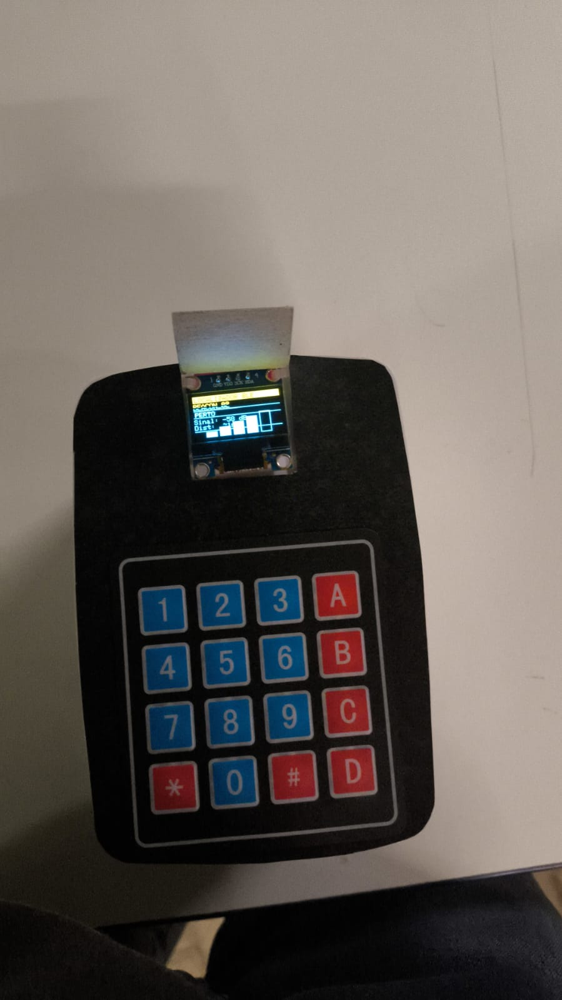
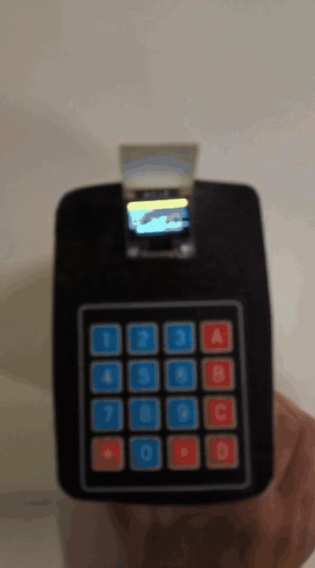

# FINDIT — Sistema de Rastreamento por Proximidade com ESP32 e BLE

!

## 📌 Sobre o projeto

O **FINDIT** é um sistema de rastreamento por proximidade desenvolvido com microcontroladores **ESP32** e comunicação **Bluetooth Low Energy (BLE)**.

O projeto surgiu a partir da necessidade de facilitar a localização de setores e itens em ambientes com estoques dinâmicos, nos quais mudanças frequentes na disposição física podem dificultar a localização de produtos.

A solução utiliza dispositivos ESP32 configurados como **Beacons BLE** e um ESP32 atuando como **Scanner**, capaz de identificar o beacon selecionado e utilizar a intensidade do sinal recebido (**RSSI**) como referência para indicar sua proximidade.

O projeto foi desenvolvido como **Projeto Integrador Multidisciplinar** do curso de Análise e Desenvolvimento de Sistemas.

---

## 🎯 Objetivo

Desenvolver uma solução embarcada de baixo custo capaz de auxiliar na localização de itens ou setores através da intensidade de sinais Bluetooth Low Energy.

O FINDIT foi projetado para funcionar de maneira autônoma, sem depender de conexão Wi-Fi ou acesso à Internet.

---

## ⚙️ Como funciona

O funcionamento básico pode ser representado da seguinte maneira:

```text
┌─────────────────┐
│   ESP32 Beacon  │
│                 │
│ Transmissão BLE │
└────────┬────────┘
         │
         │ Bluetooth Low Energy
         ▼
┌─────────────────┐
│  ESP32 Scanner  │
│                 │
│  Leitura RSSI   │
└────────┬────────┘
         │
         ├── Display OLED
         │
         └── Teclado 4x4
```

Cada Beacon transmite continuamente sua identificação através de BLE.

O Scanner procura pelo beacon selecionado e utiliza o valor de **RSSI (Received Signal Strength Indicator)** para fornecer uma estimativa de proximidade.

Quanto mais forte o sinal recebido, maior tende a ser a proximidade entre o Scanner e o Beacon.

---

## 🧰 Hardware utilizado

- ESP32 DevKit
- Display OLED SSD1306 0,96"
- Teclado membrana 4x4
- Cabos jumper
- Protoboard
- Alimentação USB / Power Bank

---

## 💻 Tecnologias e conceitos

- C / C++
- Arduino
- ESP32
- Bluetooth Low Energy (BLE)
- RSSI
- Comunicação I2C
- Sistemas embarcados
- Interface com display OLED
- Teclado matricial 4x4

---

## 📡 Beacon BLE

O firmware do Beacon configura o ESP32 para transmitir continuamente sua identificação através de Bluetooth Low Energy.

Exemplo:

```cpp
#define BEACON_NAME "BEACON_01"
```

Foram previstos diferentes transmissores:

```text
BEACON_01
BEACON_02
BEACON_03
BEACON_04
```

Cada Beacon pode ser associado a um setor ou item que deverá ser localizado.

---

## 📟 Scanner

O Scanner é responsável por:

- realizar buscas por dispositivos BLE;
- identificar o Beacon selecionado;
- obter a intensidade do sinal RSSI;
- estimar a proximidade;
- apresentar as informações no display OLED;
- permitir a navegação através do teclado 4x4.

Durante o rastreamento, o usuário recebe informações visuais sobre a intensidade do sinal e a proximidade aproximada do Beacon.

---

## ⌨️ Interface

O Scanner possui uma interface controlada através de um teclado membrana 4x4.

Entre as funcionalidades implementadas estão:

- navegação pelo menu;
- seleção de Beacons;
- início do rastreamento;
- retorno às telas anteriores;
- consulta de informações do Beacon ativo.

O mapeamento completo das teclas está disponível em:

```text
Docs/Manual Teclado FINDIT.pdf
```

---

## 📁 Estrutura do repositório

```text
.
├── Docs/
│   ├── FINDIT_Projeto_Completo_ABNT.docx
│   └── Manual Teclado FINDIT.pdf
│
├── Firmware/
│   ├── beacon.ino
│   ├── Scanner/
│   │   └── scanner_radar.ino
│   │
│   └── Experimental/
│       ├── esp32_display_interface_lcd.c
│       └── README_LCD.md
│
├── Media/
│   ├── Projeto Findit.jpeg
│   └── demonstracao-findit.mp4
│
├── .gitignore
└── README.md
```

> A pasta `Experimental` contém uma implementação alternativa desenvolvida para uma arquitetura utilizando display LCD 16x2.

---

## 🎥 Demonstração

O protótipo físico do FINDIT foi testado utilizando o Scanner ESP32, display OLED, teclado matricial e comunicação BLE com os Beacons.

A demonstração apresenta a utilização da interface do FINDIT e o rastreamento por proximidade através da intensidade do sinal BLE (RSSI).

>### 🎥 Demonstração em funcionamento



---

## 📊 Resultados

Durante os testes, o sistema conseguiu:

- detectar Beacons BLE;
- identificar o transmissor selecionado;
- medir a intensidade do sinal em dBm;
- estimar a proximidade com base no RSSI;
- apresentar as informações no display;
- permitir navegação pelo sistema através do teclado.

Nos testes realizados em ambiente interno, o alcance útil observado ficou em aproximadamente **10 metros**, podendo variar devido a obstáculos, interferências e características do ambiente.

---

## ⚠️ Limitações

A estimativa baseada em RSSI não fornece uma posição geográfica exata.

A intensidade do sinal BLE pode sofrer influência de fatores como:

- paredes e obstáculos;
- interferências eletromagnéticas;
- orientação da antena;
- distância;
- características físicas do ambiente.

Portanto, o FINDIT deve ser entendido como um **sistema de indicação de proximidade**, e não como um sistema de posicionamento preciso.

---

## 🚀 Possíveis melhorias

Entre as possibilidades de evolução do projeto estão:

- utilização de múltiplos receptores para melhorar a estimativa de posição;
- utilização de tecnologias de maior precisão, como UWB;
- persistência de configurações na memória do ESP32;
- cadastro dinâmico de novos Beacons;
- alertas sonoros de proximidade;
- integração com aplicativo mobile;
- aprimoramento da interface gráfica;
- testes em ambientes de estoque reais.

---

## 📚 Contexto acadêmico

O FINDIT foi desenvolvido como **Projeto Integrador Multidisciplinar**, integrando conhecimentos relacionados a:

- Algoritmos e Lógica de Programação;
- Arquitetura de Computadores;
- Engenharia de Software;
- Sistemas Operacionais;
- Inglês Técnico.

O desenvolvimento envolveu desde levantamento de requisitos e planejamento até montagem do hardware, implementação do firmware, integração dos componentes e realização de testes.

---

## 👥 Autores

Projeto desenvolvido pelo **Grupo FINDIT**:

- Isabely Victória
- Rubens Bartolomeu
- Clara Ferrari
- Filipe Matos Silva
- Vitor Hoshika

---

## 📄 Documentação

A documentação acadêmica completa e o manual de utilização estão disponíveis na pasta:

```text
Docs/
```

---

## 🎓 Projeto acadêmico

Projeto desenvolvido para fins acadêmicos no curso de **Análise e Desenvolvimento de Sistemas — FATEC**.
